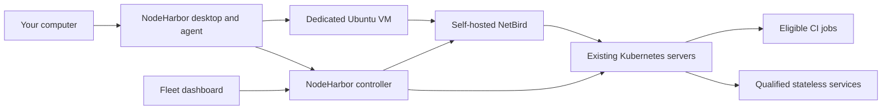

# NodeHarbor

Contribute spare capacity from your own computers to a private Kubernetes fleet.
You choose the CPU, memory, disk, schedule, power rules, and workload types.
NodeHarbor runs the worker inside its own Linux VM and connects it using NetBird.

**Implementation in progress.** The desktop, agent, enrollment API, and cluster
adapters have local automated coverage. Published packages, deployed networking,
and real worker acceptance are tracked in [the delivery log](docs/implementation-log.md).

## Install

On macOS or Ubuntu:

```sh
curl -fsSL https://raw.githubusercontent.com/gu1p/nodeharbor/main/get-nodeharbor.sh | bash
```

On Windows, in PowerShell:

```powershell
irm https://raw.githubusercontent.com/gu1p/nodeharbor/main/get-nodeharbor.ps1 | iex
```

The installer selects the native package and verifies its SHA-256 digest through
the GitHub Releases API. You can also download installers directly from
[Releases](https://github.com/gu1p/nodeharbor/releases): `.exe` for Windows, `.dmg`
for macOS, and `.deb` or `.AppImage` for Ubuntu. Build archives, manifests, and
signed verification records stay in GitHub Actions instead of the download list.
The native Android ARM64 implementation adds an `.apk` and its corresponding
runtime sources to qualified releases. Its build, continuous-running controls,
and remaining release prerequisites are documented in [Android](docs/android.md).
macOS installs into `~/Applications`; Ubuntu adds an application menu entry;
Windows uses the native installer. Run the same command to update. Updates pause
sharing and preserve enrollment and your resource rules.

During preparation, **Your machine → Worker activity** shows the current step,
elapsed time, live command output, and errors. It updates every second. Turn off
**Follow latest output** to read earlier entries, or use **Copy logs** to share
diagnostics. The latest 500 entries are kept for the current app session;
credentials and command input are excluded from the log.

The macOS app includes its Lima VM runtime and uses application-managed networking
without changing your VPN configuration. On Windows and Ubuntu, install
[Multipass](https://canonical.com/multipass/install) before preparing a worker.
Open NodeHarbor, enroll using the code supplied by your fleet administrator,
choose resource limits and sharing rules, and prepare the worker.
For an existing macOS worker, use **Your machine → Replace worker** to move to the
bundled runtime. Replacement drains work, removes the previous worker's access,
and deletes its owned disk after confirmation. Enrollment and sharing rules remain;
sharing stays off until you prepare the replacement and enable it again.
Installing NodeHarbor alone does not contribute resources. Pilot packages are
unsigned by Apple or Microsoft; NodeHarbor does not disable OS security checks.

## Architecture



The desktop uses Tauri, React, TypeScript, and Rust. The controller uses Axum and
SQLite through SQLx. The macOS app bundles Lima with its `user-v2` network; Windows
and Ubuntu use Multipass. Each VM remains subject to ownership receipts and the
same contribution lifecycle. NetBird supplies
private connectivity; it does not create Kubernetes workers. NodeHarbor owns worker
enrollment, local sharing policy, VM lifecycle, and fleet eligibility.

Android uses Kotlin and native Jetpack Compose components, a foreground owner
service, shared Rust policy, and an isolated QEMU ARM64 runtime. Its network broker
uses Android's existing connection and VPN policy.

## Development

Install Rust, Node.js, Python 3.11 or newer, and the
[Tauri native prerequisites](https://v2.tauri.app/start/prerequisites/).
Linux builds also require `libxss-dev` for the idle-time sensor.

```sh
npm --prefix ui ci
make check
cd desktop
../ui/node_modules/.bin/tauri dev
```

On Windows use `python scripts/check.py` in place of `make check`. Local tests
do not require access to a fleet or launch a VM. Real sharing needs an enrollment
code from your fleet administrator and a packaged app (or Multipass on Windows
and Ubuntu).

Environment-specific configuration and credentials belong in your private
infrastructure repository. This public repository must never contain device
credentials, cluster credentials, or private deployment settings.

## Supported release targets

| System | CPU | Packages |
| --- | --- | --- |
| macOS 14+ | Apple Silicon, Intel | DMG |
| Ubuntu 24.04 | ARM64, x64 | Debian package and AppImage |
| Windows | x64 | NSIS installer |
| Android 13+ | ARM64 | APK; release qualification pending |

Pilot desktop packages do not yet use Apple Developer ID distribution signing
or a Windows distribution certificate. The release pipeline must verify all five
desktop targets and the Android device/fleet qualification before publishing a release.
