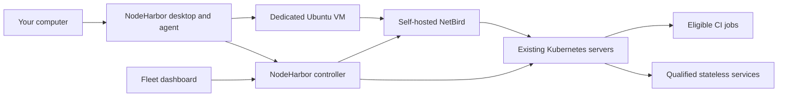

# NodeHarbor

Contribute spare capacity from your own computers to a private Kubernetes fleet.
You choose the CPU, memory, disk, schedule, power rules, and workload types.
NodeHarbor runs the worker inside its own Linux VM and connects it using NetBird.

**Implementation in progress.** The desktop, agent, enrollment API, and cluster
adapters have local automated coverage. Published packages, deployed networking,
and real worker acceptance are tracked in [the delivery log](docs/implementation-log.md).

## Install

On macOS or Ubuntu:

```sh
curl -fsSL https://raw.githubusercontent.com/gu1p/nodeharbor/main/get-nodeharbor.sh | bash
```

On Windows, in PowerShell:

```powershell
irm https://raw.githubusercontent.com/gu1p/nodeharbor/main/get-nodeharbor.ps1 | iex
```

The installer selects the native package and verifies its SHA-256 digest through
the GitHub Releases API. You can also download installers directly from
[Releases](https://github.com/gu1p/nodeharbor/releases): `.exe` for Windows, `.dmg`
for macOS, and `.deb` or `.AppImage` for Ubuntu. Build archives, manifests, and
signed verification records stay in GitHub Actions instead of the download list.
The native Android ARM64 implementation adds an `.apk` and its corresponding
runtime sources to qualified releases. Its build, continuous-running controls,
and remaining release prerequisites are documented in [Android](docs/android.md).
macOS installs into `~/Applications`; Ubuntu adds an application menu entry;
Windows uses the native installer. The same commands remain available for manual
installation and upgrading older versions that do not include self-update.

**App updates** controls automatic updates, which are enabled by default. NodeHarbor
checks 30 seconds after startup and every six hours while the app is running. It
downloads the matching native package, verifies its signature, pauses new assignments,
and waits for existing jobs to finish before stopping the worker and restarting the
app. Automatic updates never evict jobs or force a drain deadline. Sharing resumes
according to your current rules; a pause made during an update remains a pause.
You can check, install, cancel, or disable updates in the same panel. Ubuntu Debian
packages can require normal OS authorization to install. An unavailable controller,
unknown workload inventory, or failed signature postpones installation.

The HTTPS update channel is hosted on GitHub Pages. Windows and Ubuntu update payloads
use the existing release installers; macOS application bundles and the signed update
metadata are served separately, keeping the release download list limited to installers.
The release signing key stays in GitHub Actions secrets; applications contain only its
public verification key. All native checks and release publication must succeed before
a version becomes available for automatic updates.

On macOS, verified bundles are staged beside the installed application and replaced
using Apple's native file-replacement API. Updates work when the system temporary
directory is on a different disk, without changing `TMPDIR`. The application directory
must be writable by its owner; the normal installer uses `~/Applications`. Older
installations need the current installer once to obtain the corrected updater.

During preparation, **Your machine → Worker activity** shows the current step,
elapsed time, live command output, and errors. It updates every second. Turn off
**Follow latest output** to read earlier entries, or use **Copy logs** to share
diagnostics. The latest 500 entries are kept for the current app session;
credentials and command input are excluded from the log.

The macOS and Linux apps include Lima and use application-managed networking
without changing your VPN configuration. Linux also requires QEMU 6.2 or newer,
`qemu-img`, and permission to use KVM. On Windows, install
[Multipass](https://canonical.com/multipass/install) before preparing a worker.
Open NodeHarbor, enroll using the code supplied by your fleet administrator,
choose resource limits and sharing rules, and prepare the worker. On macOS and
Linux, Storage locations lets you select folders and allocations, then review
and apply them. An empty selection uses the displayed application-managed folder.
Existing disks can be moved, grown, shrunk, or removed, and more disks can be added.
Shrink and removal use a verified private backup and replacement images, with
temporary space and downtime reviewed before applying. **Delete all worker storage**
requires explicit confirmation and keeps storage disabled while retaining enrollment.
Optional automatic recovery waits two minutes for a missing disk, then can discard
the entire old pool and rebuild on remaining selected disks. Existing installations
keep waiting until the owner enables recovery; Pause and Stop override recovery.
Windows supports the single-disk replacement flow with Multipass Hyper-V and
readable Hyper-V storage metadata; other Multipass drivers cannot yet be verified
for shrinking. Host configuration and VPN settings are preserved.
See [storage lifecycle behavior and validation](docs/storage-lifecycle-validation.md)
for coverage and native tests still required, and [storage support](docs/storage-724.md)
for filesystem requirements and platforms that still need native testing.
For an existing macOS worker, use **Your machine → Replace worker** to move to the
bundled runtime. Replacement drains work, removes the previous worker's access,
and deletes its owned disk after confirmation. Enrollment and sharing rules remain;
sharing stays off until you prepare the replacement and enable it again.
Installing NodeHarbor alone does not contribute resources. Pilot packages are
unsigned by Apple or Microsoft; NodeHarbor does not disable OS security checks.

## Architecture



The desktop uses Tauri, React, TypeScript, and Rust. The controller uses Axum and
SQLite through SQLx. The macOS and Linux apps bundle Lima with its `user-v2` network; Windows
uses Multipass. Each VM remains subject to ownership receipts and the
same contribution lifecycle. NetBird supplies
private connectivity; it does not create Kubernetes workers. NodeHarbor owns worker
enrollment, local sharing policy, VM lifecycle, and fleet eligibility.

Android uses Kotlin and native Jetpack Compose components, a foreground owner
service, shared Rust policy, and an isolated QEMU ARM64 runtime. Its network broker
uses Android's existing connection and VPN policy.
Its native workload, signed update and storage-pool features follow local main;
[Android port validation](docs/android-main-port.md) records phone evidence and
the remaining release acceptance checks.

## Development

Install Rust, Node.js, Python 3.11 or newer, and the
[Tauri native prerequisites](https://v2.tauri.app/start/prerequisites/).
Linux builds also require `libxss-dev` for the idle-time sensor.

```sh
npm --prefix ui ci
make check
cd desktop
../ui/node_modules/.bin/tauri dev
```

On Windows use `python scripts/check.py` in place of `make check`. Local tests
do not require access to a fleet or launch a VM. Real sharing needs an enrollment
code from your fleet administrator and a packaged app, plus Multipass on Windows
or the QEMU/KVM dependencies on Linux.

Environment-specific configuration and credentials belong in your private
infrastructure repository. This public repository must never contain device
credentials, cluster credentials, or private deployment settings.

## Supported release targets

| System | CPU | Packages |
| --- | --- | --- |
| macOS 14+ | Apple Silicon, Intel | DMG |
| Ubuntu 24.04 | ARM64, x64 | Debian package and AppImage |
| Windows | x64 | NSIS installer |
| Android 13+ | ARM64 | APK; release qualification pending |

Pilot desktop packages do not yet use Apple Developer ID distribution signing
or a Windows distribution certificate. The release pipeline must verify all five
desktop targets and the Android device/fleet qualification before publishing a release.
