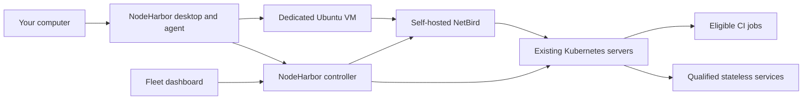

# NodeHarbor

Contribute spare capacity from your own computers to a private Kubernetes fleet.
You choose the CPU, memory, disk, schedule, power rules, and workload types.
NodeHarbor runs the worker inside its own Linux VM and connects it using NetBird.

**Implementation in progress.** The desktop, agent, enrollment API, and cluster
adapters have local automated coverage. Published packages, deployed networking,
and real worker acceptance are tracked in [the delivery log](docs/implementation-log.md).

## Architecture



The desktop uses Tauri, React, TypeScript, and Rust. The controller uses Axum and
SQLite through SQLx. Multipass manages each computer's Ubuntu VM. NetBird supplies
private connectivity; it does not create Kubernetes workers. NodeHarbor owns worker
enrollment, local sharing policy, VM lifecycle, and fleet eligibility.

## Development

Install Rust, Node.js, Python 3.11 or newer, and the
[Tauri native prerequisites](https://v2.tauri.app/start/prerequisites/).

```sh
npm --prefix ui ci
make check
cd desktop
../ui/node_modules/.bin/tauri dev
```

On Windows use `python scripts/check.py` in place of `make check`. Local tests
do not require access to a fleet or launch a VM. Real sharing additionally needs
[Multipass](https://canonical.com/multipass) and an enrollment code from your
fleet administrator.

Environment-specific configuration and credentials belong in your private
infrastructure repository. This public repository must never contain device
credentials, cluster credentials, or private deployment settings.

## Supported release targets

| System | CPU | Packages |
| --- | --- | --- |
| macOS 14+ | Apple Silicon, Intel | DMG and app archive |
| Ubuntu 24.04 | ARM64, x64 | Debian package and AppImage |
| Windows | x64 | NSIS installer |

Pilot desktop packages do not yet use Apple Developer ID distribution signing
or a Windows distribution certificate. The release pipeline must verify all five
targets before publishing a release.
